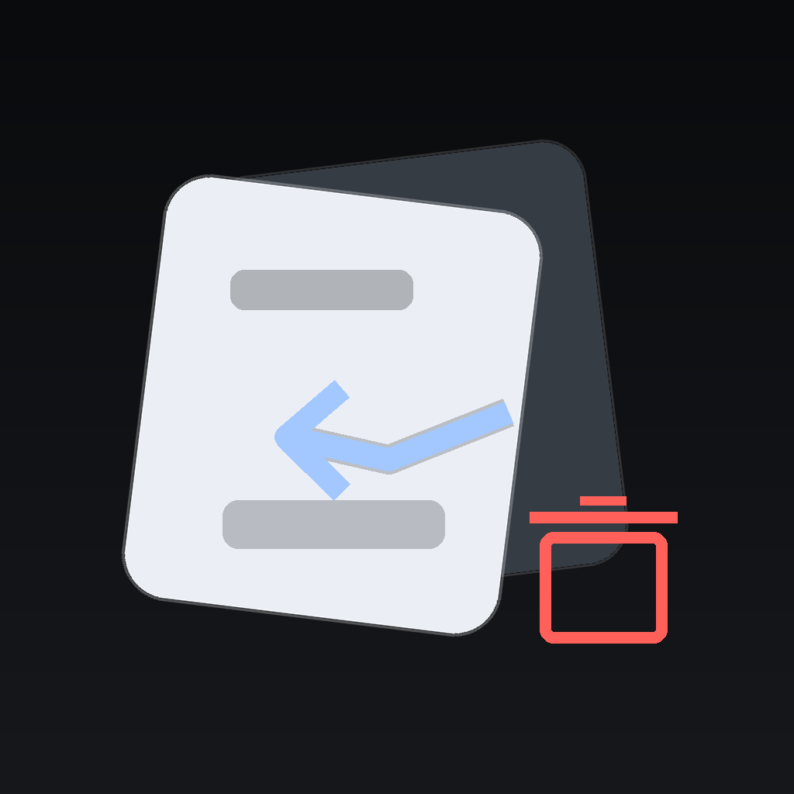
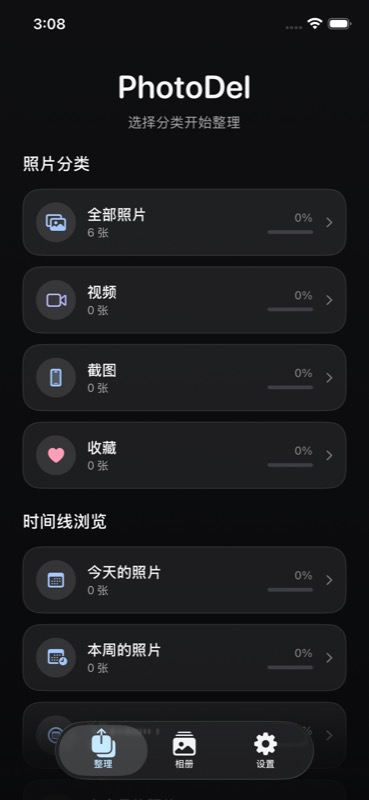

<p align="center">
  
</p>

<h1 align="center">OnePhoto / PhotoDelete</h1>

<p align="center">
  <strong>Swipe through your camera roll, queue decisions safely, and confirm before anything is changed.</strong><br />
  <strong>用滑动整理相册，先加入候选库，最后确认后再真正执行。</strong>
</p>

<p align="center">
  
  
  
  
  
</p>

<p align="center">
  <a href="#中文">中文</a> · <a href="#english">English</a>
</p>

<p align="center">
  
</p>

<p align="center">
  <em>Home screen with real Photos library categories and progress.</em>
</p>

## 中文

### 项目定位

删图（技术项目名：PhotoDelete）是一款 iPhone 相册整理工具。它用卡片滑动和双行浏览两种模式帮助用户快速判断照片去留：左滑加入待删除、右滑保留、上滑收藏、下滑跳过。所有删除和收藏都会先进入候选库，用户在确认页复核后，应用才会通过系统 Photos 框架执行真实操作。

核心清理功能免费、无账号、无广告。支持者版通过 StoreKit 一次性内购解锁长期清理统计、成就、按日/周/月/年整理和进阶清理队列。照片处理在本机完成，应用不会上传照片、视频或整理决策。

### 主要功能

| 功能 | 说明 |
| --- | --- |
| 滑动整理 | 默认左滑删除、右滑保留、上滑收藏、下滑跳过；左/右/上滑可在设置中调整，支持撤销上一步 |
| 候选库确认 | 删除和收藏先暂存，进入 `BatchConfirmView` 复核后统一提交 |
| 分类入口 | 全部照片、视频、截图、实况照片、收藏，以及今天/本周/本月/上月/更早 |
| 浏览模式 | 支持单张卡片模式和双行浏览模式 |
| 用户相册 | 浏览用户相册，支持创建、改名、删除用户相册，并可快速归类照片 |
| 进阶功能 | 支持者版可查看日/周/月/年进度，相似照片、大文件、截图、视频清理队列 |
| 清理成就 | 本机记录整理次数、删除数量、估算节省空间、连续整理天数和月度统计 |
| 偏好设置 | 简体中文、繁体中文、English；跟随系统/日间/夜间；触感反馈；手势预设 |
| 反馈与隐私 | 邮件反馈会附带基础诊断信息；隐私说明和创作者信息在设置页内可查看 |

### 快速开始

要求：

- Xcode 16.4+
- iOS 16.0+ deployment target
- 模拟器可用于 UI 和基础流程；Photos 框架、iCloud 照片、有限照片库、真实删除/收藏建议用真机验证

通过 Xcode 运行：

```bash
cd IOSAPP
open PhotoDelete.xcodeproj
```

选择模拟器或真机后按 Cmd+R 运行。

命令行构建：

```bash
SIMULATOR_DESTINATION="$(scripts/resolve-ios-simulator-destination.sh)"
xcodebuild -project IOSAPP/PhotoDelete.xcodeproj -scheme PhotoDelete \
  -destination "$SIMULATOR_DESTINATION" \
  -derivedDataPath IOSAPP/DerivedData \
  clean build
```

运行测试：

```bash
SIMULATOR_DESTINATION="$(scripts/resolve-ios-simulator-destination.sh)"
xcodebuild test \
  -project IOSAPP/PhotoDelete.xcodeproj \
  -scheme PhotoDelete \
  -destination "$SIMULATOR_DESTINATION" \
  -derivedDataPath IOSAPP/DerivedData
```

CI 当前会执行 `build-for-testing`，并运行 `PhotoDeleteTests` 单元测试。UI 测试覆盖引导页、首页可操作状态、设置页核心入口和非简体环境下的反馈入口。

### 发布与站点

TestFlight 发布脚本：

```bash
BUILD_NUMBER=202606111630 scripts/release-testflight.sh
```

`BUILD_NUMBER` 必须使用 UTC+8 的 `yyyyMMddHHmm` 格式，并且要大于 App Store Connect/TestFlight 已存在的最高 build number。脚本会先运行测试、检查 App Icon alpha channel，然后 archive 并上传。

官网与隐私政策位于 `site/`，通过 Cloudflare Pages 部署到 `photodelete.01mvp.com`。真实 iOS 截图和 App Store 上传素材位于 `Marketing/PhotoDeleteCampaign/`，其中 `actual-ios-screenshots-v4/` 是当前真实 App UI 的首选截图来源。

### 项目结构

| 路径 | 用途 |
| --- | --- |
| `IOSAPP/PhotoDelete.xcodeproj` | Xcode 项目 |
| `IOSAPP/PhotoDelete/` | SwiftUI App 源码 |
| `IOSAPP/PhotoDeleteTests/` | Swift Testing 单元测试 |
| `IOSAPP/PhotoDeleteUITests/` | XCTest UI smoke tests |
| `IOSAPP/Config/PhotoDelete-Info.plist` | 权限、Bundle、方向等 Info.plist 配置 |
| `site/` | 官网和隐私政策静态站点 |
| `Marketing/PhotoDeleteCampaign/` | App Store 截图、宣传文案和截图生成素材 |
| `scripts/` | 模拟器解析和 TestFlight 发布脚本 |

### 核心模块

| 模块 | 文件 |
| --- | --- |
| App 入口与状态 | `PhotoDeleteApp.swift`, `ContentView.swift`, `MainTabView.swift` |
| 数据模型 | `Models.swift` |
| 业务状态 | `DataManager.swift` |
| Photos 集成 | `PhotoLibraryManager.swift`, `LibrarySnapshotStore.swift` |
| 核心整理界面 | `HomeView.swift`, `SwipePhotoView.swift` |
| 相册 | `AlbumsView.swift` |
| 进阶与成就 | `AdvancedView.swift`, `CleanupStatsStore.swift`, `CleanupAchievements.swift`, `CleanupAchievementsView.swift` |
| 设置与支持者版 | `SettingsView.swift`, `SettingsSupportDetailViews.swift`, `SupporterView.swift`, `PurchaseManager.swift` |
| 本地化与设计系统 | `Localization.swift`, `AppLanguage.swift`, `Localizable.xcstrings`, `DesignSystem.swift` |
| 反馈诊断 | `FeedbackDiagnostics.swift` |

### 隐私

删图使用系统 Photos 框架读取和管理照片。照片、视频、相册内容和整理决策不会上传到服务器。应用没有接入第三方广告追踪 SDK；StoreKit 内购、评分、外部链接和邮件反馈会使用相应的系统能力。

隐私政策：[photodelete.01mvp.com/privacy](https://photodelete.01mvp.com/privacy/)

### 项目信息

- Bundle ID: `com.01mvp.photodelete`
- Website: [photodelete.01mvp.com](https://photodelete.01mvp.com)
- Part of [01MVP](https://01mvp.com), built by MakerJackie
- Copyright (c) 2025-2026 MakerJackie / 01MVP. All rights reserved.

---

## English

### What It Is

OnePhoto is an iPhone photo cleanup app built with SwiftUI and the Photos framework. The technical project name remains PhotoDelete. It lets you review your camera roll with swipe gestures or a two-row browser, queue delete/favorite decisions safely, then confirm everything before the app writes changes back to the real Photos library.

The core cleanup flow is free, accountless, ad-free, and on-device. A one-time StoreKit supporter unlock adds long-term cleanup stats, achievements, day/week/month/year review, and advanced cleanup queues. The app does not upload photos, videos, or cleanup decisions.

### Features

| Feature | Details |
| --- | --- |
| Swipe review | Default gestures: left to queue delete, right to keep, up to favorite, down to skip; left/right/up can be customized in Settings; undo is available |
| Safe confirmation | Delete/favorite actions are staged until `BatchConfirmView` commits them |
| Smart entry points | All Photos, Videos, Screenshots, Live Photos, Favorites, and time groups |
| Review modes | Single-card mode and two-row browser mode |
| User albums | Browse user albums, create/rename/delete user albums, and file photos quickly |
| Advanced | Supporter-only period progress and queues for similar photos, large files, screenshots, and videos |
| Achievements | Local cleanup history, monthly summaries, streaks, estimated space saved, and milestones |
| Preferences | Simplified Chinese, Traditional Chinese, English; system/light/dark appearance; haptics; gesture presets |
| Feedback & privacy | Mail feedback includes basic diagnostics; privacy and creator info are available in Settings |

### Getting Started

Requirements:

- Xcode 16.4+
- iOS 16.0+ deployment target
- Simulator is good for UI and basic flows; use a physical iPhone for Photos, iCloud Photos, limited library access, and real delete/favorite validation

Run with Xcode:

```bash
cd IOSAPP
open PhotoDelete.xcodeproj
```

Select a simulator or device, then press Cmd+R.

Build from the command line:

```bash
SIMULATOR_DESTINATION="$(scripts/resolve-ios-simulator-destination.sh)"
xcodebuild -project IOSAPP/PhotoDelete.xcodeproj -scheme PhotoDelete \
  -destination "$SIMULATOR_DESTINATION" \
  -derivedDataPath IOSAPP/DerivedData \
  clean build
```

Run tests:

```bash
SIMULATOR_DESTINATION="$(scripts/resolve-ios-simulator-destination.sh)"
xcodebuild test \
  -project IOSAPP/PhotoDelete.xcodeproj \
  -scheme PhotoDelete \
  -destination "$SIMULATOR_DESTINATION" \
  -derivedDataPath IOSAPP/DerivedData
```

CI currently builds for testing and runs the `PhotoDeleteTests` unit test target. UI tests cover onboarding, home state, Settings controls, and feedback visibility outside Simplified Chinese.

### Release And Site

TestFlight release script:

```bash
BUILD_NUMBER=202606111630 scripts/release-testflight.sh
```

`BUILD_NUMBER` must use UTC+8 `yyyyMMddHHmm` format and must be greater than the highest build already visible in App Store Connect/TestFlight. The script runs tests, checks app icons for alpha channels, archives, exports, and uploads.

The website and privacy policy live in `site/` and deploy to Cloudflare Pages at `photodelete.01mvp.com`. Real iOS screenshots and App Store assets live in `Marketing/PhotoDeleteCampaign/`; `actual-ios-screenshots-v4/` is the preferred source for current real-app UI.

### Project Layout

| Path | Purpose |
| --- | --- |
| `IOSAPP/PhotoDelete.xcodeproj` | Xcode project |
| `IOSAPP/PhotoDelete/` | SwiftUI app source |
| `IOSAPP/PhotoDeleteTests/` | Swift Testing unit tests |
| `IOSAPP/PhotoDeleteUITests/` | XCTest UI smoke tests |
| `IOSAPP/Config/PhotoDelete-Info.plist` | Permissions, bundle metadata, orientations |
| `site/` | Static website and privacy policy |
| `Marketing/PhotoDeleteCampaign/` | App Store screenshots, promo copy, and screenshot generation assets |
| `scripts/` | Simulator resolver and TestFlight release script |

### Architecture

| Area | Files |
| --- | --- |
| App shell | `PhotoDeleteApp.swift`, `ContentView.swift`, `MainTabView.swift` |
| Models | `Models.swift` |
| App state | `DataManager.swift` |
| Photos integration | `PhotoLibraryManager.swift`, `LibrarySnapshotStore.swift` |
| Core cleanup UI | `HomeView.swift`, `SwipePhotoView.swift` |
| Albums | `AlbumsView.swift` |
| Advanced & achievements | `AdvancedView.swift`, `CleanupStatsStore.swift`, `CleanupAchievements.swift`, `CleanupAchievementsView.swift` |
| Settings & supporter | `SettingsView.swift`, `SettingsSupportDetailViews.swift`, `SupporterView.swift`, `PurchaseManager.swift` |
| Localization & design | `Localization.swift`, `AppLanguage.swift`, `Localizable.xcstrings`, `DesignSystem.swift` |
| Feedback diagnostics | `FeedbackDiagnostics.swift` |

### Privacy

OnePhoto uses Apple's Photos framework to read and manage the local library. Photos, videos, library contents, and cleanup decisions are not uploaded to a server. The app does not include third-party advertising tracking SDKs; StoreKit purchases, ratings, external links, and mail feedback use their corresponding system services.

Privacy Policy: [photodelete.01mvp.com/en/privacy](https://photodelete.01mvp.com/en/privacy/)

### Project Info

- Bundle ID: `com.01mvp.photodelete`
- Website: [photodelete.01mvp.com](https://photodelete.01mvp.com)
- Part of [01MVP](https://01mvp.com), built by MakerJackie
- Copyright (c) 2025-2026 MakerJackie / 01MVP. All rights reserved.
