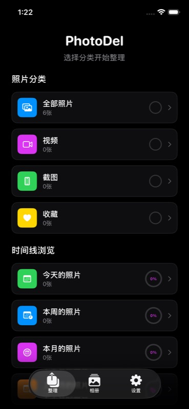

<p align="center">
  
</p>

<h1 align="center">PhotoDel</h1>

<p align="center">
  <strong>免费的 iPhone 相册清理工具 — 左右滑动快速整理照片</strong>
</p>

<p align="center">
  
  
  
  
</p>

<p align="center">
  <a href="README.md">English</a>
</p>

---

## 产品截图

<p align="center">
  
</p>

<p align="center">
  <em>主页 — 智能分类与时间分组</em>
</p>

> 更多截图：滑动手势、相册管理、批量确认等页面。  
> 完整的交互原型见 [`Prototype/`](Prototype/) 目录。

---

## 功能特点

### 滑动整理

| 手势 | 功能 | 视觉反馈 |
|------|------|----------|
| ← 左滑 | 标记删除 | 🔴 红色指示 |
| → 右滑 | 保留照片 | 🟢 绿色指示 |
| ↑ 上滑 | 加入收藏 | 🟡 黄色指示 |
| ↓ 下滑 | 跳过照片 | ⚪ 灰色指示 |

每一步操作都可以撤销，不会立即删除任何照片。

### 智能分类

- **按类型** — 全部照片、视频、截图、收藏
- **按时间** — 今天、本周、本月、上月、更早
- 每个分组显示环形进度条，直观展示整理完成度

### 候选库模式

照片不会立即删除，而是先进入候选库。完成整理后，统一查看并确认所有待删除的照片，一次性批量处理。

### 相册管理

创建、编辑、删除自定义相册。滑动整理界面中提供相册快捷分类按钮，方便快速归档。

### 隐私优先

- 无需注册账号
- 照片不上传，全部在本地处理
- 无分析追踪

---

## 快速开始

### 环境要求

- Xcode 16.4+
- iOS 16.0+ 部署目标
- 建议使用真机测试 Photos 框架功能

### 构建运行

```bash
cd IOSAPP
open PhotoDel.xcodeproj
```

选择模拟器或真机目标，然后 Cmd+R 构建运行。

### 命令行构建

```bash
cd IOSAPP
xcodebuild -project PhotoDel.xcodeproj -scheme PhotoDel \
  -destination 'platform=iOS Simulator,name=iPhone 17' clean build
```

---

## 项目架构

```
IOSAPP/PhotoDel/
├── PhotoDelApp.swift           # 应用入口，深色模式配置
├── ContentView.swift           # 根视图，含引导流程
├── Models.swift                # 核心数据结构
├── DataManager.swift           # 数据管理中心与批量操作
├── PhotoLibraryManager.swift   # Photos 框架集成
├── DesignSystem.swift          # UI 样式常量
├── MainTabView.swift           # 标签导航（整理 / 相册 / 设置）
├── HomeView.swift              # 照片分类与时间分组
├── SwipePhotoView.swift        # 核心滑动手势界面
├── AlbumsView.swift            # 相册管理
├── SettingsView.swift          # 统计与设置
├── SupporterView.swift         # 支持者功能与长期统计
├── PurchaseManager.swift       # StoreKit 支持者权益管理
└── Localizable.xcstrings       # 用户可见文案本地化
```

`SwipePhotoView.swift` 内同时包含 `RealPhotoCard` 和 `BatchConfirmView`，它们属于核心滑动整理流程。

### 核心设计模式

- **候选库模式** — 删除和收藏操作先在内存中暂存，用户确认后通过 `executeBatchOperations()` 批量执行
- **按需授权** — 首次操作时才请求照片库访问权限，而非启动时
- **响应式绑定** — `DataManager` 通过 Combine `@Published` 属性驱动 UI 更新

---

## 技术栈

| 层级 | 技术 |
|------|------|
| UI | SwiftUI（声明式） |
| 状态管理 | Combine + ObservableObject |
| 照片框架 | PHAsset / PHAssetCollection / PHImageManager |
| 并发 | async/await |
| 主题 | 深色模式（preferredColorScheme） |

---

## 隐私说明

PhotoDel 所有照片处理均在设备本地完成。应用请求照片库访问权限仅用于展示和整理照片，不会上传、传输或与任何服务器共享您的照片。

详情请参阅[隐私政策](https://photodel.01mvp.com)。

---

## 项目信息

[01MVP](https://01mvp.com) 项目之一，由 MakerJackie 开发。

官网：[photodel.01mvp.com](https://photodel.01mvp.com)

---

## 许可证

Copyright (c) 2025 MakerJackie / 01MVP. All rights reserved.
